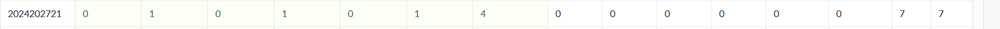
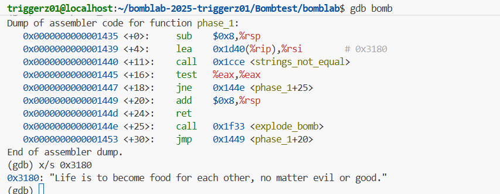

# bomblab 报告

姓名：曾翎一

学号：2024202721

| 总分 | phase_1 | phase_2 | phase_3 | phase_4 | phase_5 | phase_6 | secret_phase |
| --------- | ------------- | ------------- | ------------- | ----------------- |-----------|-----------|-----------|
| 7       | 1            | 1            | 1            | 1 |1  |1  |1  |


scoreboard 截图：



<!-- TODO: 用一个scoreboard的截图，本地图片，放到 imgs 文件夹下，不要用这个 github，pandoc 解析可能有问题 -->

## 解题报告

<!-- 对你拆掉的每个phase进行分析，并写出你得出答案的历程 -->

<!-- 如果能用伪代码还原题目源代码最佳（不属于先前提到的大段代码），语言描述自己的分析也可，每道题目的图片不建议超过两张 -->

### phase_1

```c
// 附上题目答案
Life is to become food for each other, no matter evil or good.
```

讲解题目思路
disas phase_1中出现：
lea 0x1d40(%rip),%rsi
这是将 %rip + 0x1d40 的地址加载到 %rsi 寄存器。根据注释，该地址为 0x3180，这是预设字符串的存储位置。
call 0x555555555ccc <strings_not_equal>
比较用户输入的字符串是否相等，相等返回0
test %eax,%eax
如果如果 %eax 非零（字符串不相等），则跳转到 <phase_1+25>，即调用 explode_bomb 函数，引爆炸弹。如果相等，则拆除成功
所以我们输入x/s 0x3180
得到预设字符串，然后输入该预设字符串即可得到答案。



### phase_2

```c
// 附上题目答案
700610 655998 727272 1258194
```


讲解题目思路
伪代码解释：
```c
int matA[3][3];  // 3行3列
int matB[3][2];  // 3行2列
int result[3][2]; // 计算结果，存储在栈上(rsp+0x10到rsp+0x28)
for (int i = 0; i < 3; i++) {
    for (int j = 0; j < 2; j++) {
        int sum = 0;
        for (int k = 0; k < 3; k++) {
            sum += matA[i][k] * matB[k][j];
        }
        result[i][j] = sum;
    }
}
```
```c
Dump of assembler code for function phase_2:
   0x0000000000001455 <+0>:     push   %rbp
   0x0000000000001456 <+1>:     push   %rbx
   0x0000000000001457 <+2>:     sub    $0x38,%rsp
   0x000000000000145b <+6>:     mov    %fs:0x28,%rax
   0x0000000000001464 <+15>:    mov    %rax,0x28(%rsp)
   0x0000000000001469 <+20>:    xor    %eax,%eax
   0x000000000000146b <+22>:    mov    %rsp,%rdx
   0x000000000000146e <+25>:    lea    0x4(%rsp),%rcx
   0x0000000000001473 <+30>:    lea    0xc(%rsp),%r9
   0x0000000000001478 <+35>:    lea    0x8(%rsp),%r8
   0x000000000000147d <+40>:    lea    0x214d(%rip),%rsi        # 0x35d1
   0x0000000000001484 <+47>:    call   0x1150 <__isoc99_sscanf@plt>
   0x0000000000001489 <+52>:    cmp    $0x4,%eax
--Type <RET> for more, q to quit, c to continue without paging--c
   0x000000000000148c <+55>:    jne    0x14a2 <phase_2+77>
   0x000000000000148e <+57>:    lea    0x4cab(%rip),%rdi        # 0x6140 <matA.3>
   0x0000000000001495 <+64>:    lea    0x10(%rsp),%rbx
   0x000000000000149a <+69>:    mov    $0x0,%r11d
   0x00000000000014a0 <+75>:    jmp    0x14bb <phase_2+102>
   0x00000000000014a2 <+77>:    call   0x1f33 <explode_bomb>
   0x00000000000014a7 <+82>:    jmp    0x148e <phase_2+57>
   0x00000000000014a9 <+84>:    add    $0x1,%r11d
   0x00000000000014ad <+88>:    add    $0xc,%rdi
   0x00000000000014b1 <+92>:    add    $0x8,%rbx
   0x00000000000014b5 <+96>:    cmp    $0x2,%r11d
   0x00000000000014b9 <+100>:   je     0x1502 <phase_2+173>
   0x00000000000014bb <+102>:   lea    0x4c5e(%rip),%rsi        # 0x6120 <matB.2>
   0x00000000000014c2 <+109>:   mov    %rbx,%r9
   0x00000000000014c5 <+112>:   mov    $0x0,%r8d
   0x00000000000014cb <+118>:   mov    %r9,%r10
   0x00000000000014ce <+121>:   mov    $0x0,%eax
   0x00000000000014d3 <+126>:   mov    $0x0,%ecx
   0x00000000000014d8 <+131>:   mov    (%rdi,%rax,4),%edx
   0x00000000000014db <+134>:   imul   (%rsi,%rax,8),%edx
   0x00000000000014df <+138>:   add    %edx,%ecx
   0x00000000000014e1 <+140>:   add    $0x1,%rax
   0x00000000000014e5 <+144>:   cmp    $0x3,%rax
   0x00000000000014e9 <+148>:   jne    0x14d8 <phase_2+131>
   0x00000000000014eb <+150>:   mov    %ecx,(%r10)
   0x00000000000014ee <+153>:   add    $0x1,%r8d
   0x00000000000014f2 <+157>:   add    $0x4,%r9
   0x00000000000014f6 <+161>:   add    $0x4,%rsi
   0x00000000000014fa <+165>:   cmp    $0x2,%r8d
   0x00000000000014fe <+169>:   jne    0x14cb <phase_2+118>
   0x0000000000001500 <+171>:   jmp    0x14a9 <phase_2+84>
   0x0000000000001502 <+173>:   mov    $0x0,%ebx
   0x0000000000001507 <+178>:   lea    0x10(%rsp),%rbp
   0x000000000000150c <+183>:   jmp    0x1518 <phase_2+195>
   0x000000000000150e <+185>:   add    $0x4,%rbx
   0x0000000000001512 <+189>:   cmp    $0x10,%rbx
   0x0000000000001516 <+193>:   je     0x1528 <phase_2+211>
   0x0000000000001518 <+195>:   mov    0x0(%rbp,%rbx,1),%eax
   0x000000000000151c <+199>:   cmp    %eax,(%rsp,%rbx,1)
   0x000000000000151f <+202>:   je     0x150e <phase_2+185>
   0x0000000000001521 <+204>:   call   0x1f33 <explode_bomb>
   0x0000000000001526 <+209>:   jmp    0x150e <phase_2+185>
   0x0000000000001528 <+211>:   mov    0x28(%rsp),%rax
   0x000000000000152d <+216>:   sub    %fs:0x28,%rax
   0x0000000000001536 <+225>:   jne    0x153f <phase_2+234>
   0x0000000000001538 <+227>:   add    $0x38,%rsp
   0x000000000000153c <+231>:   pop    %rbx
   0x000000000000153d <+232>:   pop    %rbp
   0x000000000000153e <+233>:   ret
   0x000000000000153f <+234>:   call   0x10a0 <__stack_chk_fail@plt>
End of assembler dump.
```
在<phase_2+102>，我们进入一个循环，这个循环使用r8d作为内层循环计数器，从0到2（因为最后比较$0x2，如果不等则继续循环）。
在<phase_2+118>到<phase_2+169>的内层循环中，有一个计算：
```c
mov (%rdi,%rax,4),%edx
imul (%rsi,%rax,8),%edx
add %edx,%ecx
```
我们可以发现他在做计算点积的操作,发现它是做了一个矩阵乘法，r11d从0开始，到2结束（<phase_2+96>比较$0x2，当等于2时跳出循环）。所以，r11d循环3次（0,1,2）。所以，矩阵A的行数为3。r8d从0到2（也是3次），所以矩阵B的列数为3。在点积计算中，我们使用(%rsi,%rax,8)，即每个元素8字节，所以B的列数为2.所以，整个过程为矩阵A（3x3）乘以矩阵B（3x2），得到结果矩阵C（3x2），存储在栈上从%rsp+0x10开始的6个int。
结果比较
```c
0x0000555555555502: mov    $0x0,%ebx            # 初始化索引
0x0000555555555507: lea    0x10(%rsp),%rbp      # result矩阵起始地址
0x000055555555550c: jmp    0x555555555518 <phase_2+195>

# 比较循环
0x0000555555555518: mov    0x0(%rbp,%rbx,1),%eax  # 取result[i]
0x000055555555551c: cmp    %eax,(%rsp,%rbx,1)     # 与用户输入比较
0x000055555555551f: je     0x55555555550e <phase_2+185>  # 相等则继续
0x0000555555555521: call   0x555555555f33 <explode_bomb>  # 不等则爆炸
```
说明用户输入的4个整数与result[0][0]、result[0][1]、result[1][0]、result[1][1]比较。
拆弹方法：
输入：
(gdb) x/9w 0x55555555a140  : 查看matA的9个整数(3x3)
(gdb) x/6w 0x55555555a120  : 查看matB的6个整数(3x2)
然后写个程序算出result数组并输出要求的四个


### phase_3

```c
// 附上题目答案
1 X 655
```

讲解题目思路
```c
Dump of assembler code for function phase_3:
   0x0000000000001544 <+0>:     sub    $0x28,%rsp
   0x0000000000001548 <+4>:     mov    %fs:0x28,%rax
   0x0000000000001551 <+13>:    mov    %rax,0x18(%rsp)
   0x0000000000001556 <+18>:    xor    %eax,%eax
   0x0000000000001558 <+20>:    lea    0xf(%rsp),%rcx
   0x000000000000155d <+25>:    lea    0x10(%rsp),%rdx
   0x0000000000001562 <+30>:    lea    0x14(%rsp),%r8
   0x0000000000001567 <+35>:    lea    0x1c87(%rip),%rsi        # 0x31f5
   0x000000000000156e <+42>:    call   0x1150 <__isoc99_sscanf@plt>
   0x0000000000001573 <+47>:    cmp    $0x2,%eax
   0x0000000000001576 <+50>:    jle    0x15a1 <phase_3+93>
   0x0000000000001578 <+52>:    mov    0x4b92(%rip),%eax        # 0x6110 <mask.1>
   0x000000000000157e <+58>:    xor    %al,0xf(%rsp)
   0x0000000000001582 <+62>:    cmpl   $0x7,0x10(%rsp)
   0x0000000000001587 <+67>:    ja     0x1699 <phase_3+341>
   0x000000000000158d <+73>:    mov    0x10(%rsp),%eax
   0x0000000000001591 <+77>:    lea    0x1c88(%rip),%rdx        # 0x3220
   0x0000000000001598 <+84>:    movslq (%rdx,%rax,4),%rax
   0x000000000000159c <+88>:    add    %rdx,%rax
   0x000000000000159f <+91>:    jmp    *%rax
   0x00000000000015a1 <+93>:    call   0x1f33 <explode_bomb>
   0x00000000000015a6 <+98>:    jmp    0x1578 <phase_3+52>
--Type <RET> for more, q to quit, c to continue without paging--c
   0x00000000000015a8 <+100>:   mov    $0x63,%eax
   0x00000000000015ad <+105>:   cmpl   $0x392,0x14(%rsp)
   0x00000000000015b5 <+113>:   je     0x16a3 <phase_3+351>
   0x00000000000015bb <+119>:   call   0x1f33 <explode_bomb>
   0x00000000000015c0 <+124>:   mov    $0x63,%eax
   0x00000000000015c5 <+129>:   jmp    0x16a3 <phase_3+351>
   0x00000000000015ca <+134>:   mov    $0x78,%eax
   0x00000000000015cf <+139>:   cmpl   $0x28f,0x14(%rsp)
   0x00000000000015d7 <+147>:   je     0x16a3 <phase_3+351>
   0x00000000000015dd <+153>:   call   0x1f33 <explode_bomb>
   0x00000000000015e2 <+158>:   mov    $0x78,%eax
   0x00000000000015e7 <+163>:   jmp    0x16a3 <phase_3+351>
   0x00000000000015ec <+168>:   mov    $0x62,%eax
   0x00000000000015f1 <+173>:   cmpl   $0x3a7,0x14(%rsp)
   0x00000000000015f9 <+181>:   je     0x16a3 <phase_3+351>
   0x00000000000015ff <+187>:   call   0x1f33 <explode_bomb>
   0x0000000000001604 <+192>:   mov    $0x62,%eax
   0x0000000000001609 <+197>:   jmp    0x16a3 <phase_3+351>
   0x000000000000160e <+202>:   mov    $0x71,%eax
   0x0000000000001613 <+207>:   cmpl   $0x2d0,0x14(%rsp)
   0x000000000000161b <+215>:   je     0x16a3 <phase_3+351>
   0x0000000000001621 <+221>:   call   0x1f33 <explode_bomb>
   0x0000000000001626 <+226>:   mov    $0x71,%eax
   0x000000000000162b <+231>:   jmp    0x16a3 <phase_3+351>
   0x000000000000162d <+233>:   mov    $0x62,%eax
   0x0000000000001632 <+238>:   cmpl   $0x17e,0x14(%rsp)
   0x000000000000163a <+246>:   je     0x16a3 <phase_3+351>
   0x000000000000163c <+248>:   call   0x1f33 <explode_bomb>
   0x0000000000001641 <+253>:   mov    $0x62,%eax
   0x0000000000001646 <+258>:   jmp    0x16a3 <phase_3+351>
   0x0000000000001648 <+260>:   mov    $0x78,%eax
   0x000000000000164d <+265>:   cmpl   $0x134,0x14(%rsp)
   0x0000000000001655 <+273>:   je     0x16a3 <phase_3+351>
   0x0000000000001657 <+275>:   call   0x1f33 <explode_bomb>
   0x000000000000165c <+280>:   mov    $0x78,%eax
   0x0000000000001661 <+285>:   jmp    0x16a3 <phase_3+351>
   0x0000000000001663 <+287>:   mov    $0x74,%eax
   0x0000000000001668 <+292>:   cmpl   $0x304,0x14(%rsp)
   0x0000000000001670 <+300>:   je     0x16a3 <phase_3+351>
   0x0000000000001672 <+302>:   call   0x1f33 <explode_bomb>
   0x0000000000001677 <+307>:   mov    $0x74,%eax
   0x000000000000167c <+312>:   jmp    0x16a3 <phase_3+351>
   0x000000000000167e <+314>:   mov    $0x7a,%eax
   0x0000000000001683 <+319>:   cmpl   $0x1ca,0x14(%rsp)
   0x000000000000168b <+327>:   je     0x16a3 <phase_3+351>
   0x000000000000168d <+329>:   call   0x1f33 <explode_bomb>
   0x0000000000001692 <+334>:   mov    $0x7a,%eax
   0x0000000000001697 <+339>:   jmp    0x16a3 <phase_3+351>
   0x0000000000001699 <+341>:   call   0x1f33 <explode_bomb>
   0x000000000000169e <+346>:   mov    $0x66,%eax
   0x00000000000016a3 <+351>:   cmp    %al,0xf(%rsp)
   0x00000000000016a7 <+355>:   jne    0x16be <phase_3+378>
   0x00000000000016a9 <+357>:   mov    0x18(%rsp),%rax
   0x00000000000016ae <+362>:   sub    %fs:0x28,%rax
   0x00000000000016b7 <+371>:   jne    0x16c5 <phase_3+385>
   0x00000000000016b9 <+373>:   add    $0x28,%rsp
   0x00000000000016bd <+377>:   ret
   0x00000000000016be <+378>:   call   0x1f33 <explode_bomb>
   0x00000000000016c3 <+383>:   jmp    0x16a9 <phase_3+357>
   0x00000000000016c5 <+385>:   call   0x10a0 <__stack_chk_fail@plt>
End of assembler dump
```
sscanf要输入格式化字符串，我们通过x/s 0x31f5得到输入的格式为
"%d %c %d"。
从汇编代码可以看出，是要第一个整数作为case的编号（必须小于7否则会爆炸），第二个整数：对应 case 要求的值。字符：(case设置的字符) XOR mask.1 的低字节
通过x/s 0x6110我们得到mask.1的值，然后输入序号1，x/s 0x31f5得到case1的值，按要求得到字符为X

### phase_4

```c
// 附上题目答案
31 BA
```
```c
Dump of assembler code for function phase_4:
   0x0000000000001789 <+0>:     push   %rbx
   0x000000000000178a <+1>:     sub    $0x20,%rsp
   0x000000000000178e <+5>:     mov    %fs:0x28,%rax
   0x0000000000001797 <+14>:    mov    %rax,0x18(%rsp)
   0x000000000000179c <+19>:    xor    %eax,%eax
   0x000000000000179e <+21>:    lea    0x10(%rsp),%rcx
   0x00000000000017a3 <+26>:    lea    0xc(%rsp),%rdx
--Type <RET> for more, q to quit, c to continue without paging--c
   0x00000000000017a8 <+31>:    lea    0x1a4f(%rip),%rsi        # 0x31fe
   0x00000000000017af <+38>:    call   0x1150 <__isoc99_sscanf@plt>
   0x00000000000017b4 <+43>:    cmp    $0x2,%eax
   0x00000000000017b7 <+46>:    jne    0x1826 <phase_4+157>
   0x00000000000017b9 <+48>:    mov    $0x5,%edi
   0x00000000000017be <+53>:    call   0x16ca <func4_1>
   0x00000000000017c3 <+58>:    cmp    %eax,0xc(%rsp)
   0x00000000000017c7 <+62>:    jne    0x182d <phase_4+164>
   0x00000000000017c9 <+64>:    lea    0x10(%rsp),%rdi
   0x00000000000017ce <+69>:    call   0x1cb1 <string_length>
   0x00000000000017d3 <+74>:    cmp    $0x2,%eax
   0x00000000000017d6 <+77>:    jne    0x1834 <phase_4+171>
   0x00000000000017d8 <+79>:    lea    0x14(%rsp),%rbx
   0x00000000000017dd <+84>:    mov    %rbx,%r9
   0x00000000000017e0 <+87>:    mov    $0x42,%r8d
   0x00000000000017e6 <+93>:    mov    $0x43,%ecx
   0x00000000000017eb <+98>:    mov    $0x41,%edx
   0x00000000000017f0 <+103>:   mov    $0x1d,%esi
   0x00000000000017f5 <+108>:   mov    $0x5,%edi
   0x00000000000017fa <+113>:   call   0x16f0 <func4_2>
   0x00000000000017ff <+118>:   lea    0x10(%rsp),%rdi
   0x0000000000001804 <+123>:   mov    %rbx,%rsi
   0x0000000000001807 <+126>:   call   0x1cce <strings_not_equal>
   0x000000000000180c <+131>:   test   %eax,%eax
   0x000000000000180e <+133>:   jne    0x183b <phase_4+178>
   0x0000000000001810 <+135>:   mov    0x18(%rsp),%rax
   0x0000000000001815 <+140>:   sub    %fs:0x28,%rax
   0x000000000000181e <+149>:   jne    0x1842 <phase_4+185>
   0x0000000000001820 <+151>:   add    $0x20,%rsp
   0x0000000000001824 <+155>:   pop    %rbx
   0x0000000000001825 <+156>:   ret
   0x0000000000001826 <+157>:   call   0x1f33 <explode_bomb>
   0x000000000000182b <+162>:   jmp    0x17b9 <phase_4+48>
   0x000000000000182d <+164>:   call   0x1f33 <explode_bomb>
   0x0000000000001832 <+169>:   jmp    0x17c9 <phase_4+64>
   0x0000000000001834 <+171>:   call   0x1f33 <explode_bomb>
   0x0000000000001839 <+176>:   jmp    0x17d8 <phase_4+79>
   0x000000000000183b <+178>:   call   0x1f33 <explode_bomb>
   0x0000000000001840 <+183>:   jmp    0x1810 <phase_4+135>
   0x0000000000001842 <+185>:   call   0x10a0 <__stack_chk_fail@plt>
End of assembler dump.
(gdb) x/s 0x31fe
0x31fe: "%d %2s"
(gdb) disas func4_1
Dump of assembler code for function func4_1:
   0x00000000000016ca <+0>:     mov    $0x0,%eax
   0x00000000000016cf <+5>:     test   %edi,%edi
   0x00000000000016d1 <+7>:     jle    0x16ef <func4_1+37>
   0x00000000000016d3 <+9>:     mov    %edi,%eax
   0x00000000000016d5 <+11>:    cmp    $0x1,%edi
   0x00000000000016d8 <+14>:    je     0x16ef <func4_1+37>
   0x00000000000016da <+16>:    sub    $0x8,%rsp
   0x00000000000016de <+20>:    sub    $0x1,%edi
   0x00000000000016e1 <+23>:    call   0x16ca <func4_1>
   0x00000000000016e6 <+28>:    lea    0x1(%rax,%rax,1),%eax
   0x00000000000016ea <+32>:    add    $0x8,%rsp
   0x00000000000016ee <+36>:    ret
   0x00000000000016ef <+37>:    ret
End of assembler dump.
(gdb) disas_func4_2
Undefined command: "disas_func4_2".  Try "help".
(gdb) disas func4_2
Dump of assembler code for function func4_2:
   0x00000000000016f0 <+0>:     push   %r15
   0x00000000000016f2 <+2>:     push   %r14
   0x00000000000016f4 <+4>:     push   %r13
   0x00000000000016f6 <+6>:     push   %r12
   0x00000000000016f8 <+8>:     push   %rbp
   0x00000000000016f9 <+9>:     push   %rbx
   0x00000000000016fa <+10>:    sub    $0x8,%rsp
   0x00000000000016fe <+14>:    mov    %edx,%r12d
   0x0000000000001701 <+17>:    mov    %ecx,%r13d
   0x0000000000001704 <+20>:    mov    %r9,%rbp
   0x0000000000001707 <+23>:    cmp    $0x1,%edi
   0x000000000000170a <+26>:    je     0x1736 <func4_2+70>
   0x000000000000170c <+28>:    mov    %esi,%ebx
   0x000000000000170e <+30>:    mov    %r8d,%r14d
   0x0000000000001711 <+33>:    lea    -0x1(%rdi),%r15d
   0x0000000000001715 <+37>:    mov    %r15d,%edi
   0x0000000000001718 <+40>:    call   0x16ca <func4_1>
   0x000000000000171d <+45>:    cmp    %ebx,%eax
   0x000000000000171f <+47>:    jge    0x1750 <func4_2+96>
   0x0000000000001721 <+49>:    lea    0x1(%rax),%edx
   0x0000000000001724 <+52>:    cmp    %ebx,%edx
   0x0000000000001726 <+54>:    jne    0x176b <func4_2+123>
   0x0000000000001728 <+56>:    mov    %r12b,0x0(%rbp)
   0x000000000000172c <+60>:    mov    %r13b,0x1(%rbp)
   0x0000000000001730 <+64>:    movb   $0x0,0x2(%rbp)
   0x0000000000001734 <+68>:    jmp    0x1741 <func4_2+81>
   0x0000000000001736 <+70>:    mov    %dl,0x0(%rbp)
   0x0000000000001739 <+73>:    mov    %cl,0x1(%rbp)
   0x000000000000173c <+76>:    movb   $0x0,0x2(%r9)
   0x0000000000001741 <+81>:    add    $0x8,%rsp
   0x0000000000001745 <+85>:    pop    %rbx
   0x0000000000001746 <+86>:    pop    %rbp
   0x0000000000001747 <+87>:    pop    %r12
   0x0000000000001749 <+89>:    pop    %r13
--Type <RET> for more, q to quit, c to continue without paging--c
   0x000000000000174b <+91>:    pop    %r14
   0x000000000000174d <+93>:    pop    %r15
   0x000000000000174f <+95>:    ret
   0x0000000000001750 <+96>:    movsbl %r14b,%ecx
   0x0000000000001754 <+100>:   movsbl %r12b,%edx
   0x0000000000001758 <+104>:   mov    %rbp,%r9
   0x000000000000175b <+107>:   movsbl %r13b,%r8d
   0x000000000000175f <+111>:   mov    %ebx,%esi
   0x0000000000001761 <+113>:   mov    %r15d,%edi
   0x0000000000001764 <+116>:   call   0x16f0 <func4_2>
   0x0000000000001769 <+121>:   jmp    0x1741 <func4_2+81>
   0x000000000000176b <+123>:   movsbl %r13b,%ecx
   0x000000000000176f <+127>:   movsbl %r14b,%edx
   0x0000000000001773 <+131>:   sub    %eax,%ebx
   0x0000000000001775 <+133>:   lea    -0x1(%rbx),%esi
   0x0000000000001778 <+136>:   mov    %rbp,%r9
   0x000000000000177b <+139>:   movsbl %r12b,%r8d
   0x000000000000177f <+143>:   mov    %r15d,%edi
   0x0000000000001782 <+146>:   call   0x16f0 <func4_2>
   0x0000000000001787 <+151>:   jmp    0x1741 <func4_2+81>
End of assembler dump.
```
通过对汇编代码的分析，phase_4 需要输入一个整数和一个长度为2的字符串，格式为 %d %2s。
整数部分：需要等于 func4_1(5) 的返回值。func4_1经解析是一个递归函数
```c
int func4_1(int n) {
    if (n <= 0) return 0;
    if (n == 1) return 1;
    int prev = func4_1(n-1);
    return 2 * prev + 1;
}
```
通过简单的推算即可得到func4_1(5)等于31
字符串的部分：需要等于调用 func4_2(5, 29, 'A', 'C', 'B', buf) 后 buf 中生成的字符串。而其函数的本质是一个汉诺塔问题，最终生成的字符串为 "BA"。
### phase_5

```c
// 附上题目答案
5nj000
```

讲解题目思路
```c
Dump of assembler code for function phase_5:
   0x0000000000001847 <+0>:     push   %rbx
   0x0000000000001848 <+1>:     mov    %rdi,%rbx
   0x000000000000184b <+4>:     call   0x1cb1 <string_length>
   0x0000000000001850 <+9>:     cmp    $0x6,%eax
   0x0000000000001853 <+12>:    jne    0x1881 <phase_5+58>
   0x0000000000001855 <+14>:    mov    %rbx,%rax
   0x0000000000001858 <+17>:    lea    0x6(%rbx),%rdi
   0x000000000000185c <+21>:    mov    $0x0,%ecx
   0x0000000000001861 <+26>:    lea    0x19d8(%rip),%rsi        # 0x3240 <array.0>
   0x0000000000001868 <+33>:    movzbl (%rax),%edx
   0x000000000000186b <+36>:    and    $0xf,%edx
   0x000000000000186e <+39>:    add    (%rsi,%rdx,4),%ecx
   0x0000000000001871 <+42>:    add    $0x1,%rax
   0x0000000000001875 <+46>:    cmp    %rdi,%rax
   0x0000000000001878 <+49>:    jne    0x1868 <phase_5+33>
   0x000000000000187a <+51>:    cmp    $0x33,%ecx
   0x000000000000187d <+54>:    jne    0x1888 <phase_5+65>
   0x000000000000187f <+56>:    pop    %rbx
   0x0000000000001880 <+57>:    ret
   0x0000000000001881 <+58>:    call   0x1f33 <explode_bomb>
   0x0000000000001886 <+63>:    jmp    0x1855 <phase_5+14>
   0x0000000000001888 <+65>:    call   0x1f33 <explode_bomb>
   0x000000000000188d <+70>:    jmp    0x187f <phase_5+56>
End of assembler dump.
```
```c
cmp $0x6,%eax 和 jne 0x1881 
```
表明输入必须是6个字符
如果不是6个字符，会调用 explode_bomb
0x1868-0x1878的代码表明他会循环处理每一个字符，用字符的低4位作为索引从数组中去到对应的数并进行累加。最终由cmp $0x33,%ecx 知道要看它等不等于51，如果等于就拆弹成功。
所以我们x/16dw 0x3240 得到数组中的内容然后选择合适的字符就行
5nj000对应[5,14,10,0,0,0]：16+15+14+2+2+2=51


### phase_6

```c
// 附上题目答案
6 2 1 5 3 4 
```

讲解题目思路
```c
Dump of assembler code for function phase_6:
   0x000000000000188f <+0>:     push   %r14
   0x0000000000001891 <+2>:     push   %r13
   0x0000000000001893 <+4>:     push   %r12
   0x0000000000001895 <+6>:     push   %rbp
   0x0000000000001896 <+7>:     push   %rbx
   0x0000000000001897 <+8>:     sub    $0x60,%rsp
   0x000000000000189b <+12>:    mov    %fs:0x28,%rax
   0x00000000000018a4 <+21>:    mov    %rax,0x58(%rsp)
   0x00000000000018a9 <+26>:    xor    %eax,%eax
   0x00000000000018ab <+28>:    mov    %rsp,%r13
   0x00000000000018ae <+31>:    mov    %r13,%rsi
   0x00000000000018b1 <+34>:    call   0x1ff3 <read_six_numbers>
   0x00000000000018b6 <+39>:    mov    $0x1,%r14d
   0x00000000000018bc <+45>:    mov    %rsp,%r12
   0x00000000000018bf <+48>:    jmp    0x18e9 <phase_6+90>
   0x00000000000018c1 <+50>:    call   0x1f33 <explode_bomb>
   0x00000000000018c6 <+55>:    jmp    0x18f8 <phase_6+105>
   0x00000000000018c8 <+57>:    add    $0x1,%rbx
--Type <RET> for more, q to quit, c to continue without paging--c
   0x00000000000018cc <+61>:    cmp    $0x5,%ebx
   0x00000000000018cf <+64>:    jg     0x18e1 <phase_6+82>
   0x00000000000018d1 <+66>:    mov    (%r12,%rbx,4),%eax
   0x00000000000018d5 <+70>:    cmp    %eax,0x0(%rbp)
   0x00000000000018d8 <+73>:    jne    0x18c8 <phase_6+57>
   0x00000000000018da <+75>:    call   0x1f33 <explode_bomb>
   0x00000000000018df <+80>:    jmp    0x18c8 <phase_6+57>
   0x00000000000018e1 <+82>:    add    $0x1,%r14
   0x00000000000018e5 <+86>:    add    $0x4,%r13
   0x00000000000018e9 <+90>:    mov    %r13,%rbp
   0x00000000000018ec <+93>:    mov    0x0(%r13),%eax
   0x00000000000018f0 <+97>:    sub    $0x1,%eax
   0x00000000000018f3 <+100>:   cmp    $0x5,%eax
   0x00000000000018f6 <+103>:   ja     0x18c1 <phase_6+50>
   0x00000000000018f8 <+105>:   cmp    $0x5,%r14d
   0x00000000000018fc <+109>:   jg     0x1903 <phase_6+116>
   0x00000000000018fe <+111>:   mov    %r14,%rbx
   0x0000000000001901 <+114>:   jmp    0x18d1 <phase_6+66>
   0x0000000000001903 <+116>:   mov    $0x0,%esi
   0x0000000000001908 <+121>:   mov    (%rsp,%rsi,4),%ecx
   0x000000000000190b <+124>:   mov    $0x1,%eax
   0x0000000000001910 <+129>:   lea    0x4909(%rip),%rdx        # 0x6220 <node1>
   0x0000000000001917 <+136>:   cmp    $0x1,%ecx
   0x000000000000191a <+139>:   jle    0x1927 <phase_6+152>
   0x000000000000191c <+141>:   mov    0x8(%rdx),%rdx
   0x0000000000001920 <+145>:   add    $0x1,%eax
   0x0000000000001923 <+148>:   cmp    %ecx,%eax
   0x0000000000001925 <+150>:   jne    0x191c <phase_6+141>
   0x0000000000001927 <+152>:   mov    %rdx,0x20(%rsp,%rsi,8)
   0x000000000000192c <+157>:   add    $0x1,%rsi
   0x0000000000001930 <+161>:   cmp    $0x6,%rsi
   0x0000000000001934 <+165>:   jne    0x1908 <phase_6+121>
   0x0000000000001936 <+167>:   mov    0x20(%rsp),%rbx
   0x000000000000193b <+172>:   mov    0x28(%rsp),%rax
   0x0000000000001940 <+177>:   mov    %rax,0x8(%rbx)
   0x0000000000001944 <+181>:   mov    0x30(%rsp),%rdx
   0x0000000000001949 <+186>:   mov    %rdx,0x8(%rax)
   0x000000000000194d <+190>:   mov    0x38(%rsp),%rax
   0x0000000000001952 <+195>:   mov    %rax,0x8(%rdx)
   0x0000000000001956 <+199>:   mov    0x40(%rsp),%rdx
   0x000000000000195b <+204>:   mov    %rdx,0x8(%rax)
   0x000000000000195f <+208>:   mov    0x48(%rsp),%rax
   0x0000000000001964 <+213>:   mov    %rax,0x8(%rdx)
   0x0000000000001968 <+217>:   movq   $0x0,0x8(%rax)
   0x0000000000001970 <+225>:   mov    $0x5,%ebp
   0x0000000000001975 <+230>:   jmp    0x1980 <phase_6+241>
   0x0000000000001977 <+232>:   mov    0x8(%rbx),%rbx
   0x000000000000197b <+236>:   sub    $0x1,%ebp
   0x000000000000197e <+239>:   je     0x1991 <phase_6+258>
   0x0000000000001980 <+241>:   mov    0x8(%rbx),%rax
   0x0000000000001984 <+245>:   mov    (%rax),%eax
   0x0000000000001986 <+247>:   cmp    %eax,(%rbx)
   0x0000000000001988 <+249>:   jge    0x1977 <phase_6+232>
   0x000000000000198a <+251>:   call   0x1f33 <explode_bomb>
   0x000000000000198f <+256>:   jmp    0x1977 <phase_6+232>
   0x0000000000001991 <+258>:   mov    0x58(%rsp),%rax
   0x0000000000001996 <+263>:   sub    %fs:0x28,%rax
   0x000000000000199f <+272>:   jne    0x19ae <phase_6+287>
   0x00000000000019a1 <+274>:   add    $0x60,%rsp
   0x00000000000019a5 <+278>:   pop    %rbx
   0x00000000000019a6 <+279>:   pop    %rbp
   0x00000000000019a7 <+280>:   pop    %r12
   0x00000000000019a9 <+282>:   pop    %r13
   0x00000000000019ab <+284>:   pop    %r14
   0x00000000000019ad <+286>:   ret
   0x00000000000019ae <+287>:   call   0x10a0 <__stack_chk_fail@plt>
End of assembler dump.

(gdb) x/20wx 0x6220
0x6220 <node1>: 0x000001fb      0x00000001      0x00006230      0x00000000
0x6230 <node2>: 0x0000026a      0x00000002      0x00006240      0x00000000
0x6240 <node3>: 0x000001a2      0x00000003      0x00006250      0x00000000
0x6250 <node4>: 0x0000007e      0x00000004      0x00006260      0x00000000
0x6260 <node5>: 0x000001f4      0x00000005      0x00006170      0x00000000
```
我们通过分析汇编代码发现必须要输入6个整数
```c
cmp $0x1,%ecx
jle 0x1927 <phase_6+152> ; 如果ecx<=1，则跳转到152
mov 0x8(%rdx),%rdx ; 否则，rdx = [rdx+8]（即下一个节点）
add $0x1,%eax
cmp %ecx,%eax
jne 0x191c <phase_6+141>
```
根据数字的值遍历链表。程序希望我们降序输入节点编号，如下面
```c
0x0000000000001980 <+241>:   mov    0x8(%rbx),%rax      ; rax = 下一个节点
0x0000000000001984 <+245>:   mov    (%rax),%eax         ; eax = 下一个节点的值
0x0000000000001986 <+247>:   cmp    %eax,(%rbx)         ; 比较当前节点的值和下一个节点的值
0x0000000000001988 <+249>:   jge    0x1977 <phase_6+232> ; 跳转下一个
0x000000000000198a <+251>:   call   0x1f33 <explode_bomb> ; 否则引爆炸弹
```
我们输入x/20wx 0x6220插看node的值，比第一关键字
得到顺序：x/20wx 

### phase_secret

```c
// 附上题目答案
33022
```

讲解题目思路
如何触发secret_phase，先disas defuse函数，发现了secret_phase的地址
发现其本质上是让我们在最后一个问题中要输入6个空格，第6题6个数5个空格，再加一个空格输入我的密码cipher即可进入最终阶段
```c
Dump of assembler code for function secret_phase:
   0x0000000000001bda <+0>:     push   %rbx
   0x0000000000001bdb <+1>:     lea    0x1623(%rip),%rdi        # 0x3205
   0x0000000000001be2 <+8>:     call   0x1070 <puts@plt>
   0x0000000000001be7 <+13>:    call   0x2034 <read_line>
   0x0000000000001bec <+18>:    mov    %rax,%rbx
   0x0000000000001bef <+21>:    mov    %rax,%rdi
   0x0000000000001bf2 <+24>:    call   0x1cb1 <string_length>
   0x0000000000001bf7 <+29>:    cmp    $0x14,%eax
   0x0000000000001bfa <+32>:    jg     0x1c2a <secret_phase+80>
   0x0000000000001bfc <+34>:    mov    $0x0,%ecx
   0x0000000000001c01 <+39>:    mov    $0x0,%edx
   0x0000000000001c06 <+44>:    mov    $0x0,%esi
   0x0000000000001c0b <+49>:    mov    %rbx,%rdi
   0x0000000000001c0e <+52>:    call   0x19b3 <func7>
   0x0000000000001c13 <+57>:    test   %eax,%eax
   0x0000000000001c15 <+59>:    je     0x1c31 <secret_phase+87>
   0x0000000000001c17 <+61>:    lea    0x15a2(%rip),%rdi        # 0x31c0
   0x0000000000001c1e <+68>:    call   0x1070 <puts@plt>
   0x0000000000001c23 <+73>:    call   0x216e <phase_defused>
   0x0000000000001c28 <+78>:    pop    %rbx
   0x0000000000001c29 <+79>:    ret
   0x0000000000001c2a <+80>:    call   0x1f33 <explode_bomb>
--Type <RET> for more, q to quit, c to continue without paging--c
   0x0000000000001c2f <+85>:    jmp    0x1bfc <secret_phase+34>
   0x0000000000001c31 <+87>:    call   0x1f33 <explode_bomb>
   0x0000000000001c36 <+92>:    jmp    0x1c17 <secret_phase+61>
End of assembler dump.
这是secret_phase的汇编代码，请你解析并告诉我如何去拆
```
这个本质上是马走棋盘问题，我们先调出有哪些障碍物，然后写一个BFS规划出路径为答案

### ......

## 反馈/收获/感悟/总结

<!-- 这一节，你可以简单描述你在这个 lab 上花费的时间/你认为的难度/你认为不合理的地方/你认为有趣的地方 -->

<!-- 或者是收获/感悟/总结 -->
学习到了会变得代码，出发secret尤其有趣
<!-- 200 字以内，可以不写 -->

## 参考的重要资料

<!-- 有哪些文章/论文/PPT/课本对你的实现有重要启发或者帮助，或者是你直接引用了某个方法 -->

<!-- 请附上文章标题和可访问的网页路径 -->
CSAPP